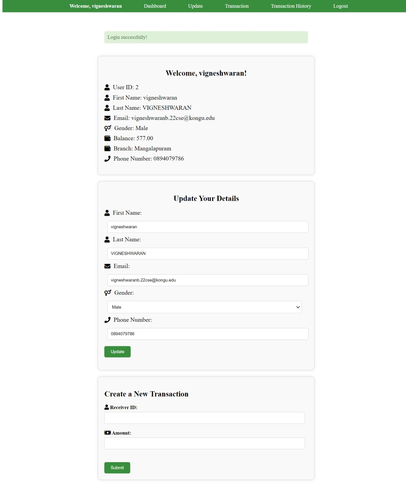

# Bank Management System

This project is a Bank Management System implemented using Django, designed to facilitate efficient account management and transaction tracking.

## Features

- **Secure Authentication**: Users can securely log in and manage their accounts.
- **Account Management**: Admins can create, update, and delete customer accounts.
- **Transaction Tracking**: Keep track of deposits, withdrawals, and transfers.
- **User-friendly Interface**: Intuitive design for easy navigation and operation.

## Technologies Used

- Django
- Python
- HTML/CSS
- MySQL

## Installation

To run this project locally, follow these steps:

1. Clone the repository:
    ```sh
   git clone https://github.com/vigneshwaranbalamurugan/Bank_Management_Django
    ```
2. Navigate into the project directory:
   ``` sh
   cd bank-management-system
   ```
3. Install dependencies:
   ```sh
   pip install -r requirements.txt
   ```
4. Run migrations:
   ```sh
   python manage.py makemigrate
   ```
5. Run server:
   ```sh
   python manage.py runserver
   ```
6. open your web browser and visit:
   ```sh
   http://localhost:8000/
   ```

## **Screenshots**

<br>

1.**Home Page**

  


<br>

2.**Login Page**


<br>

3.**User Dashboard**



<br>

4.**Transaction History**


<br>

5.**Database Schema**


<br>

6.**Admin Dashboard**


<br>

7.**Add User**


## Authors

- [**Vigneshwaran**](https://github.com/vigneshwaranbalamurugan)
- [**Vijay Bharath**](https://github.com/VijayFencer)
- [**Shriraam**](https://github.com/Shriraam-6219)

